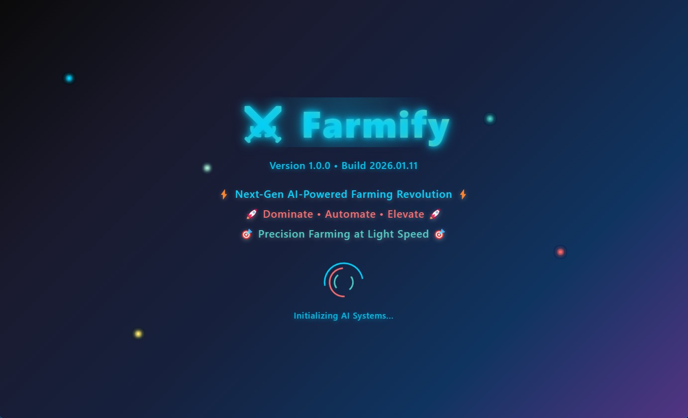
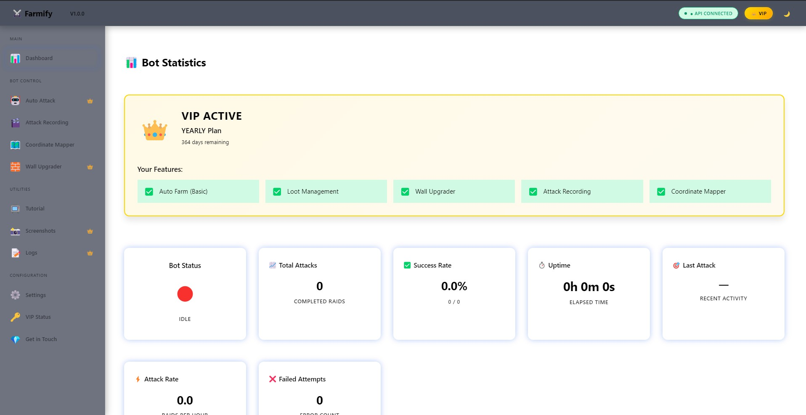
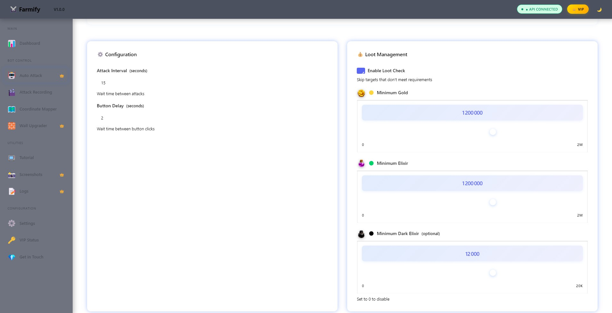
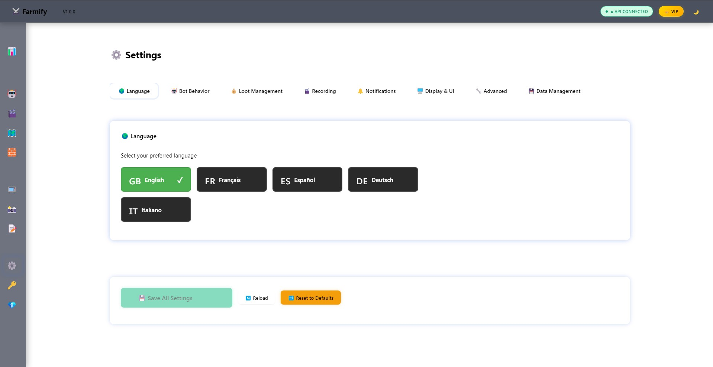

# 🚜 Farmify

**Advanced Clash of Clans Attack Automation & Optimization Tool**

> Automate your attack strategies, save time, and dominate the battlefield.

---

### Farmify

## ✨ Key Features

- 🎯 **Smart Attack Recording** - Record your attack sequences with pixel-perfect precision
- ▶️ **Automatic Playback** - Replay your strategies automatically with consistent timing
- 🖼️ **Screen Mapping** - Adapt to any screen resolution with easy coordinate calibration
- 🎮 **Game Detection** - Automatically finds and monitors your Clash of Clans window
- 📊 **Attack Library** - Build and organize your best attack strategies
- ⚡ **Custom Hotkeys** - Control everything with customizable keyboard shortcuts
- 🔍 **Advanced OCR** - Intelligent number detection for loot tracking and planning

---

### Dashboard

## 🚀 Getting Started

### System Requirements

- **Windows 10** or later
- **Clash of Clans** (any version)
- Compatible with emulators: BlueStacks, NoxPlayer, LDPlayer, MEmu
- Screen resolution: 1280x720 or higher recommended

### Installation

**Join our Discord for download links and setup guides:**

👉 **[Join Farmify Discord Community](https://discord.gg/k9eKAdJDxA)** 👈

In Discord, you'll find:

- ✅ Latest application downloads
- ✅ Step-by-step installation guides
- ✅ Video tutorials
- ✅ Troubleshooting support
- ✅ Community tips and strategies
- ✅ Feature announcements

---

## 📸 Features Overview

### Attack Recording & Playback

Record your attack sequences in real-time and replay them automatically. Perfect for:

- Farming strategies
- War attack sequences
- Raiding patterns
- Tournament preparation

### Coordinate Mapping

Calibrate button positions for your screen resolution:

- Map your game buttons once
- Use across multiple sessions
- Supports any resolution

### Advanced Analytics

- Track loot earnings
- Monitor attack success rates
- Analyze strategy effectiveness
- Plan optimized farming routes

---

### Auto Attack

## 🎓 How to Use

1. **Download** the latest version from our [Discord server](https://discord.gg/k9eKAdJDxA)
2. **Install** following the included setup guide
3. **Map Coordinates** of your game buttons
4. **Record** your attack strategies
5. **Automate** and let Farmify handle the rest

Detailed video tutorials are available in the Discord community.

---

### Language

## ⚠️ Important Disclaimer

Farmify is designed for educational and entertainment purposes. Users are responsible for:

- Understanding and following Clash of Clans Terms of Service
- Account security and any consequences from automation
- Responsible use of the tool

**Always supervise automated actions and follow the game's guidelines.**

---

## 🔒 Safety & Security

- **Failsafe Controls** - Emergency stop with a single keystroke
- **Session Validation** - Verify attacks before playback
- **Logging System** - Track all actions for debugging and auditing
- **Local Storage** - All data stored locally on your machine

---

## 💬 Community & Support

Have questions? Need help? Found a bug?

**[Join our Discord](https://discord.gg/k9eKAdJDxA)** - Our community is active and helpful!

- 📖 Tutorials and guides
- 🆘 Technical support
- 💡 Strategy discussions
- 📢 Feature requests
- 🤝 Community showcase

---

## 📝 License

Educational and entertainment use only. See LICENSE.txt for full terms.

---

**Made with ❤️ by the Farmify Team**

_Clash of Clans is a trademark of Supercell. Farmify is not affiliated with Supercell._
